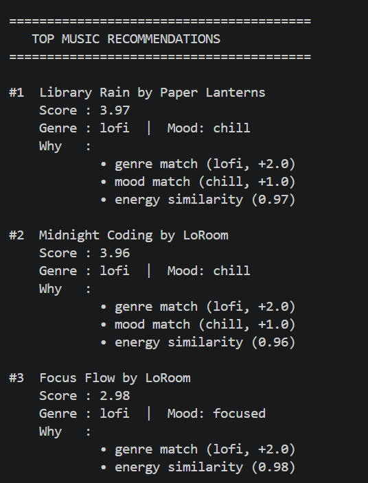
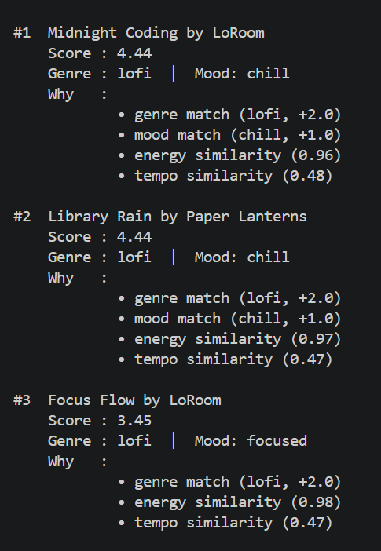

# 🎵 VibeFinder 1.0 — Music Recommender Simulation

## Project Summary

This project is a working **CLI-first** content-based music recommender. You give it a user taste profile and it scores every song in a 20-song catalog, then prints the top 5 matches with a plain-English reason for each one.

Run it from the project root:

```bash
python src/main.py
```

---

## How It Works

Each song gets a score based on 4 rules:

| Rule | Points |
|---|---|
| Genre matches the user's favorite genre | +2.0 |
| Mood matches the user's mood | +1.0 |
| Energy is close to the user's target energy | 0.0 – 1.0 |
| Tempo is close to the user's target BPM | 0.0 – 0.5 |

All 20 songs are scored independently, sorted highest to lowest, and the top 5 are shown. Every result includes a "Why" breakdown so you can see exactly which rules fired.

### Song Features Used

| Feature | Type | Role |
|---|---|---|
| `genre` | text | +2.0 pts if it matches |
| `mood` | text | +1.0 pt if it matches |
| `energy` | 0–1 float | continuous similarity score |
| `tempo_bpm` | integer | small similarity bonus |
| `valence`, `danceability`, `acousticness` | 0–1 float | loaded but not scored yet |

### User Profile Fields

| Field | What it does |
|---|---|
| `genre` | matched against each song's genre |
| `mood` | matched against each song's mood |
| `target_energy` | compared to song energy (closer = higher score) |
| `target_tempo_bpm` | compared to song BPM (closer = small bonus) |

---

## Getting Started

### Setup

1. Create a virtual environment (optional but recommended):

```bash
python -m venv .venv
source .venv/bin/activate      # Mac or Linux
.venv\Scripts\activate         # Windows
```

2. Install dependencies:

```bash
pip install -r requirements.txt
```

3. Run the app from the project root:

```bash
python src/main.py
```

> Make sure you run from the project root — not from inside `src/`. The app loads `data/songs.csv` using a relative path.

### Running Tests

```bash
pytest
```

---

## User Profiles

Six profiles are defined in `src/main.py`. Switch the active one by changing this line:

```python
user_prefs = profile_lofi_focus   # change to any profile below
```

| Profile variable | Genre | Mood | Energy | Type |
|---|---|---|---|---|
| `profile_lofi_focus` | lofi | chill | 0.38 | Normal — late-night study |
| `profile_pop_workout` | pop | euphoric | 0.92 | Normal — high-energy gym |
| `profile_intense_rock` | rock | intense | 0.88 | Normal — driving or venting |
| `profile_conflict_energy_mood` | metal | sad | 0.90 | Edge case — mood vs energy conflict |
| `profile_unknown_genre` | bossa nova | relaxed | 0.45 | Edge case — genre not in catalog |
| `profile_neutral_energy` | jazz | moody | 0.50 | Edge case — neutral energy |

---

## Screenshots

**CLI verification — songs loaded successfully:**



**Recommendations after switching profiles:**



---

## Experiments

**Weight shift:** Genre was halved (2.0 → 1.0) and energy was doubled (×2). The top 3 results did not change. Only songs ranked #4 and #5 shifted. This shows weights only matter at the boundary — when the catalog has no strong all-around match.

**Tempo added as a 4th signal:** Adding tempo similarity (up to +0.5) was enough to flip the #1 result. Midnight Coding (78 BPM) beat Library Rain (72 BPM) because it was closer to the target of 76 BPM. It also pushed the sad country song out of the top 5.

**Feature removal:** Removing the mood check collapsed rankings to genre + energy only. Songs with the right energy but completely wrong mood surfaced — confirming mood is a meaningful signal even at only +1.0.

---

## Surprises

- **A sad country song floated into a chill lofi playlist.** "Broken Porch" had no genre match and no mood match, but its energy (0.38) was exactly the target. The system can't penalize a bad match — only reward a good one — so it quietly snuck in.

- **Genre weight locks in the same 2–3 songs.** The +2.0 bonus is bigger than mood + energy combined. For lofi users the same three songs appeared at the top every single run.

- **Unknown genre doesn't crash — it just silently drops the bonus.** Requesting "bossa nova" (not in catalog) gave every song a 0 for genre. The list fell back to mood + energy only — plausible but impersonal.

- **Neutral energy (0.5) flattens the ranking.** Every song scored a moderate energy similarity, so genre and mood dominated completely. Songs without a genre or mood match all clustered at the bottom with nearly identical scores.

---

## Limitations

- Most genres have only 1 song — so genre match is more like a lookup than a preference signal
- Mood must match exactly — "chill" and "relaxed" score zero against each other
- Very calm users (target energy below 0.25) can never get a perfect energy score — the quietest song in the catalog has energy 0.22
- Five features (valence, danceability, acousticness, instrumentalness, speechiness) are loaded but not used in scoring

---

## Reflection

Building this showed that even a very simple scoring rule can feel like a real recommendation — especially when you explain why each song was picked. The "why" next to each result made the output feel thoughtful, even though the algorithm just added up four numbers.

The biggest lesson: the algorithm can't penalize a bad match. It only rewards. That one detail explains almost every weird result we saw — a sad country song in a study playlist, high-energy songs in a calm profile, the same lofi tracks appearing every time. Real recommenders feel smarter largely because they have millions of songs to choose from, not because their math is more sophisticated.

Read the full model card here: [**model_card.md**](model_card.md)

---

## File Structure

```
├── data/
│   └── songs.csv              # 20-song catalog
├── src/
│   ├── main.py                # Run this — defines profiles and prints results
│   └── recommender.py         # load_songs, score_song, recommend_songs
├── tests/
│   └── test_recommender.py    # Starter tests
├── assets/                    # CLI_Verification.png, Recommand_after_profile.png
├── model_card.md              # Full bias and evaluation writeup
├── reflection.md              # Profile comparison notes
└── README.md
```
