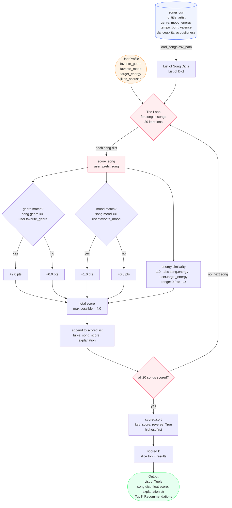

# Music Recommender — Data Flow Diagram



## Single Song Journey (Example: Library Rain — song #4)

```mermaid
sequenceDiagram
    participant CSV as songs.csv
    participant LS as load_songs()
    participant LOOP as recommend_songs() loop
    participant SS as score_song()
    participant OUT as Output

    CSV->>LS: row: Library Rain, lofi, chill, energy=0.35
    LS->>LOOP: Dict {genre:lofi, mood:chill, energy:0.35}
    LOOP->>SS: score_song(user_prefs, song)
    SS->>SS: genre lofi == lofi → +2.0
    SS->>SS: mood chill == chill → +1.0
    SS->>SS: 1.0 - abs(0.35 - 0.40) = 0.95 → +0.95
    SS-->>LOOP: (score=3.95, explanation)
    LOOP->>LOOP: append (song, 3.95, explanation) to scored[]
    LOOP->>LOOP: sort all 20 scores descending
    LOOP-->>OUT: scored[:k] → Library Rain is Rank #1
```

## Score Breakdown Reference

| Points | Condition | Max |
|--------|-----------|-----|
| +2.0 | `song.genre == user.favorite_genre` | 2.0 |
| +1.0 | `song.mood == user.favorite_mood` | 1.0 |
| +0.0–1.0 | `1.0 - abs(song.energy - user.target_energy)` | 1.0 |
| | **Total possible** | **4.0** |
